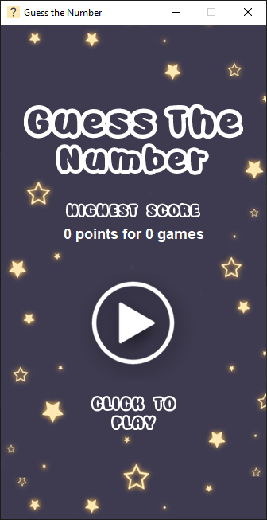
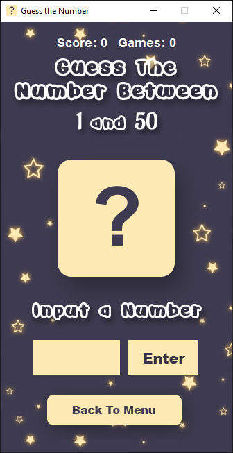
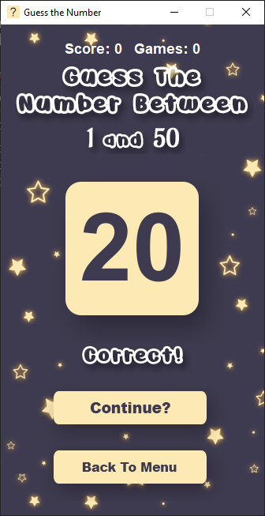

<h1 align="center">
    
     
    <b>Guess The Number</b>
     
    
    
   
</h1>

<h4 align = "center">
A Laboratory Exercise in Computer Programming 2 that implements the Try and Catch Functionality as well as File Handling. I make the activity more interesting by adding GUI (Java Swing) with sounds and images.
</h4>

## **Run the Program** 📜
 To run the program, the device must have:
 - Java JDK (Used JDK version 11.0.8)
 - IDE (Netbeans, Eclipse, Intellj)

## **Instruction of the Game** 📚
1. Click the Play button
2. Guess a Number by typing in the text field and click enter
3. When you guess incorrectly, the status will change that help you figure out the number
4. Upon guessing the correct number, the question mark is replace with a correct number
5. You can continue the game repeatedly
6. Upon clicking the back to menu, the game will end
7. The score then will store in the high score text file in the scores folder
8. When you score higher compare inside the text file, it will overwrite

## **Scoring System** 🌟
The score or points you gain is determined on the number of attempts you made per Game. You can change this system if you want in the ScoreSystem.java, under scoreAttempt() method.
| Points        | Attempts           |
| ------------- |:-------------:|
| 10 points     | 1st attempt |
| 9 points      | 2nd attempt      |
| 5 points      | 3rd attempt      | 
| 3 points      | 4th attempt      |
| 1 point       | 5th attempt and so on     | 

## **Determining the High Score** 💯
Take note that there are 3 variables in determining the High Score:
- Score: The score is simply the number of points you gain depending on the number of attempts.
- Attempts: Is the number of guesses you made in a single game to find out a number.
- Game: Is the number of times you play the game in a row. ( Increases when you click the continue button after figuring out the number)  

If your new score is higher than the data in the txt file, the old score will be overwritten. There are times when the number of points is equal, so in that case the program will determined the highest score based on the number of games you played.

| Old High Score   | Old High Num of Games | New Score    | New Num of Games | The Highest Score (Overwrite?) | 
| ---------------- |:---------------------:|:------------:|:----------------:|:------------------------------:|
| 18 points        | 6 games               | 25 points    | 9 games          | Yes
| 20 points        | 8 games               | 10 points    | 10 games         | No
| 30 points        | 6 games               | 30 points    | 4 games          | Yes
| 40 points        | 8 games               | 40 points    | 10 games         | No

**Take Note:** The Old implies the information contained in the High Score.txt file, whereas the New means the information gathered after your most recent game.

## **Game Screen Shots** 📷

	
	
  

## **Game Resources** 🎮
- Background Image 
  - In the Google Images
- Font Style Used 
  - Arial
  - Awesome Possum Outline
- Background Music: 
  - Far Away Puzzle Places by Eric Matyas
  - Website: [Sound Image](www.soundimage.org)
- Sound Effects:
  - [Correct: 0:00 - 0:03s](https://www.youtube.com/watch?v=worclOeTALw)
  - [Wrong: 0:04s - 0:05s](https://www.youtube.com/watch?v=worclOeTALw)

## **Contribution** 🔥
If you wish to help improve this project, fork this repo and submit your own pull request. If you discover a problem with this project, please report it to the issue page. Thank you very much   😊.

## **Thank you** 💖
If you like this project just click ⭐ and share it with others.
